<div align="center">
  
</div>

<h1 align="center">Reinaldo Barreto</h1>

<p align="center">
  <strong>JavaScript Software Engineer · Node.js Backend First</strong><br/>
  APIs escaláveis com NestJS, aplicações web com Next.js e experiências mobile com React Native.
</p>

<p align="center">
  <a href="https://git.io/typing-svg">
    
  </a>
</p>

<p align="center">
  <a href="https://developer.mozilla.org/docs/Web/JavaScript">
    
  </a>
  <a href="https://nodejs.org/">
    
  </a>
  <a href="https://nestjs.com/">
    
  </a>
  <a href="https://nextjs.org/">
    
  </a>
</p>

<p align="center">
  <a href="https://react.dev/"></a>
  <a href="https://reactnative.dev/"></a>
  <a href="https://www.typescriptlang.org/"></a>
  <a href="https://www.postgresql.org/"></a>
  <a href="https://supabase.com/"></a>
  <a href="https://www.docker.com/"></a>
</p>

## `> whoami`

Sou Software Engineer full-cycle com foco principal em **JavaScript e Node.js**.
Construo backends seguros e modulares, produtos web modernos e aplicativos
mobile multiplataforma. Minha prioridade é transformar regras de negócio em
sistemas claros, testáveis, observáveis e preparados para produção.

```javascript
const reinaldo = {
  language: "JavaScript",
  backend: ["Node.js", "NestJS", "REST", "Realtime"],
  web: ["Next.js", "React.js", "TypeScript"],
  mobile: ["React Native", "Expo"],
  data: ["PostgreSQL", "Supabase", "SQLite"],
  principles: ["Clean Architecture", "Security", "UX", "Performance"],
};
```

## Ecossistema principal

<div align="center">
  <a href="https://developer.mozilla.org/docs/Web/JavaScript">
    
  </a>
  &nbsp;&nbsp;&nbsp;&nbsp;
  <a href="https://nodejs.org/">
    
  </a>
  &nbsp;&nbsp;&nbsp;
  <a href="https://nestjs.com/">
    
  </a>
  &nbsp;&nbsp;&nbsp;
  <a href="https://nextjs.org/">
    
  </a>
  &nbsp;&nbsp;&nbsp;
  <a href="https://react.dev/">
    
  </a>
</div>

<br/>

<table>
  <tr>
    <td width="33%" valign="top">
      <h3>Backend em primeiro lugar</h3>
      <p>Node.js, NestJS, autenticação, autorização, pagamentos, filas, integrações, APIs REST e eventos em tempo real.</p>
    </td>
    <td width="33%" valign="top">
      <h3>Web moderna</h3>
      <p>Next.js, React.js, TypeScript, componentes reutilizáveis, acessibilidade, SEO e interfaces responsivas.</p>
    </td>
    <td width="33%" valign="top">
      <h3>Mobile premium</h3>
      <p>React Native, Expo, offline-first, mapas, notificações, animações e publicação Android/iOS.</p>
    </td>
  </tr>
</table>

## Projetos em destaque

<div align="center">
  <a href="https://github.com/reinaldobarreto/portfolio-reinaldo-react">
    
  </a>
  <a href="https://github.com/reinaldobarreto/pdfturbo">
    
  </a>
  <a href="https://github.com/reinaldobarreto/quiz-biblico">
    
  </a>
</div>

### PopFaxina

Marketplace mobile privado desenvolvido com **React Native, Expo, TypeScript e
Supabase**. Inclui mapa, contratação, chat em tempo real, OTP, pagamentos,
carteira, painel administrativo, RLS e sincronização offline.

<p>
  <a href="https://github.com/reinaldobarreto/popfaxina">
    
  </a>
</p>

## Atividade

<div align="center">
  
  
</div>

<div align="center">
  
</div>

<picture>
  <source media="(prefers-color-scheme: dark)" srcset="https://raw.githubusercontent.com/reinaldobarreto/reinaldobarreto/output/snake.svg" />
  <source media="(prefers-color-scheme: light)" srcset="https://raw.githubusercontent.com/reinaldobarreto/reinaldobarreto/output/snake-light.svg" />
  
</picture>

## Ferramentas e práticas

<p align="center">
  
</p>

- arquitetura modular e feature-first;
- APIs seguras, validação e controle de acesso;
- testes, CI/CD e revisão de código;
- UX/UI responsiva e acessível;
- observabilidade e otimização de performance;
- desenvolvimento orientado a produto.

## Vamos conversar

<p align="center">
  <a href="mailto:reinaldodevbarreto@gmail.com">
    
  </a>
  <a href="https://www.linkedin.com/in/reinaldobarreto/">
    
  </a>
  <a href="https://github.com/reinaldobarreto">
    
  </a>
</p>

<p align="center">
  
</p>
